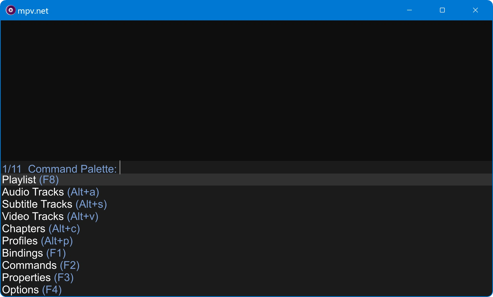
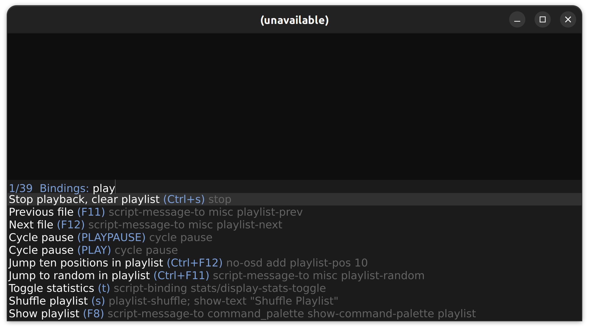
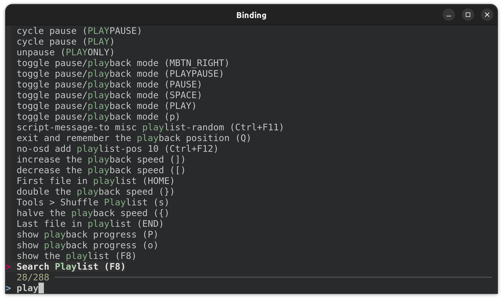
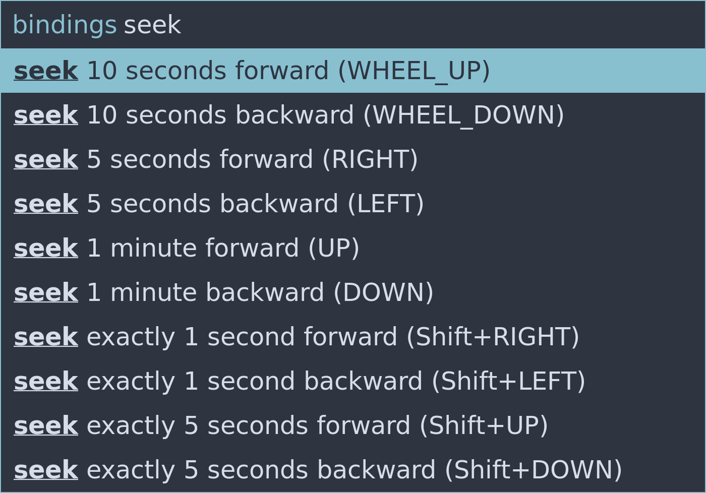
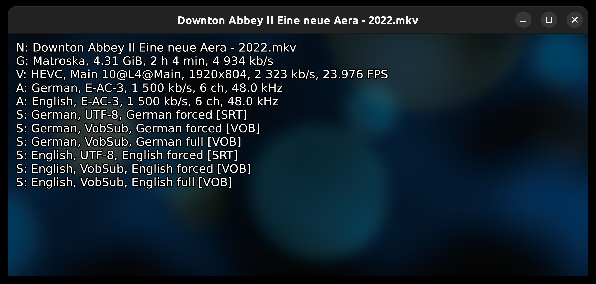

Collection of mpv user scripts.

command_palette and search_menu are documented here, all other scripts are
documented directly in the script via code comment at the beginning of the script.

- [powershell-completion](powershell/mpv-powershell-completion.ps1) - Command line completion for mpv and mpv.net.
- [command_palette](#command_palette) - Searchable menu for bindings,
  playlist, chapters, profiles, all tracks, audio tracks, video tracks,
  subtitle tracks, secondary subtitle tracks, subtitle lines, commands,
  properties, options, audio devices, Blu-ray titles, stream quality,
  aspect ratio.
- [search_menu](#search_menu) - Searchable menu for bindings, commands, properties, playlist
  entries and audio/subtitle tracks.
- [auto_mode.lua](auto_mode.lua) - Use mpv as video player, music player and image viewer.
- [delete_current_file.lua](delete_current_file.lua) - Moves the currently playing file instantly to the recycle bin.
- [file_rating.lua](file_rating.lua) - Writes a star rating to the filename of the currently playing file.
- [history.lua](history.lua) - Writes date, time, playtime and filename to a log file.
- [osm.lua](osm.lua) - Shows a customizable on screen menu.
- [misc.lua](misc.lua)
  - Show detailed media info on screen ([Screenshot](#screenshot-misclua)).
  - Cycle audio and subtitle tracks, include only languages you know.
  - Paste/Load/Append files/URLs from clipboard.
  - Jump to a random position in the playlist.
  - Navigate in playlist to next/previous/first/last file.
  - Restart mpv restoring the properties path, time-pos, pause and volume.
  - Execute Lua code from input.conf.
  - When seeking display position and duration like so: 70:00 / 80:00.
- [average_volume.lua](average_volume.lua) - Records and restores the relative volume for music.

# command_palette





command_palette is a searchable menu for:

- Command palette features
- Bindings
- Playlist
- Chapters
- Profiles
- All tracks
- Audio tracks
- Video tracks
- Subtitle tracks
- Secondary subtitle tracks
- Subtitle lines
- Commands
- Properties
- Options
- Audio devices
- Blu-ray Titles
- Stream Quality
- Aspect Ratio

### Installation

1. Save the script at: `<mpv conf folder>/scripts/command_palette.lua`
2. Create a empty text file for options at: `<mpv conf folder>/script-opts/command_palette.conf`
3. Download [extended-menu](https://github.com/Seme4eg/mpv-scripts/blob/master/script-modules/extended-menu.lua)
   and save it at: `<mpv conf folder>/script-modules/extended-menu.lua`

### Usage

Add bindings to input.conf:

```
Ctrl+p      script-message-to command_palette show-command-palette "Command Palette" # Command Palette
F1          script-message-to command_palette show-command-palette "Bindings" # Bindings
F2          script-message-to command_palette show-command-palette "Commands" # Commands
F3          script-message-to command_palette show-command-palette "Properties" # Properties
F4          script-message-to command_palette show-command-palette "Options" # Options
F8          script-message-to command_palette show-command-palette "Playlist" # Playlist
F9          script-message-to command_palette show-command-palette "Tracks" # Tracks
Alt+a       script-message-to command_palette show-command-palette "Audio Tracks" # Audio Tracks
Alt+s       script-message-to command_palette show-command-palette "Subtitle Tracks" # Subtitle Tracks
Alt+b       script-message-to command_palette show-command-palette "Secondary Subtitle" # Secondary Subtitle
Alt+v       script-message-to command_palette show-command-palette "Video Tracks" # Video Tracks
Alt+c       script-message-to command_palette show-command-palette "Chapters" # Chapters
Alt+p       script-message-to command_palette show-command-palette "Profiles" # Profiles
Alt+d       script-message-to command_palette show-command-palette "Audio Devices" # Audio Devices
Alt+l       script-message-to command_palette show-command-palette "Subtitle Line" # Subtitle Line
Alt+t       script-message-to command_palette show-command-palette "Blu-ray Titles" # Blu-ray Titles
Alt+q       script-message-to command_palette show-command-palette "Stream Quality" # Stream Quality
Alt+r       script-message-to command_palette show-command-palette "Aspect Ratio" # Aspect Ratio
```

Available options and their defaults:

```
font_size=16
scale_by_window=no
lines_to_show=12
pause_on_open=no  # might be buggy
resume_on_exit="only-if-was-paused"

# styles
line_bottom_margin=1
menu_x_padding=5
menu_y_padding=2

use_mediainfo=no  # use MediaInfo CLI tool for track info
stream_quality_options=2160,1440,1080,720,480
aspect_ratios=4:3,16:9,2.35:1,1.36,1.82,0,-1
```

### Credits

- https://github.com/mpv-player/mpv/blob/master/player/lua/select.lua
- https://github.com/Seme4eg/mpv-scripts
- https://github.com/CogentRedTester/mpv-search-page
- https://github.com/tomasklaen/uosc

### More menu scripts

https://github.com/stax76/awesome-mpv?tab=readme-ov-file#menu

# search_menu

### About

search_menu is very similar to command_palette, it's based on the external tools [Rofi](https://github.com/davatorium/rofi) (Linux) or terminal based on [fzf](https://github.com/junegunn/fzf) (cross-platform).

It provides a searchable menu for bindings, commands, properties, playlist entries and audio/subtitle tracks.





### Installation

See Dependencies section to install dependencies.

Save the search menu folder at `<mpv conf folder>/scripts/search_menu/`,
it contains main.lua and a Python script.

### Configuration

#### mpv.conf

Windows: `input-ipc-server = \\.\pipe\mpvsocket`

Linux: `input-ipc-server = /tmp/mpvsocket`

#### Conf file at `<mpv conf folder>/scripts-opts/search_menu.conf`:

```
#mode=gnome-terminal+sh    # Requires Linux and Gnome Terminal, default on Linux
#mode=alacritty+sh         # Requires Linux and Alacritty
#mode=rofi                 # Requires Linux and Rofi
#mode=alacritty+ns         # Requires Windows, Alacritty and Nushell
#mode=windows-terminal+ps  # Requires Windows and Windows Terminal, default on Windows
#mode=windows-terminal+ns  # Requires Windows, Windows Terminal and Nushell
```

On Windows Alacritty and Nushell have the advantage of a faster startup.

On Linux Alacritty has the advantage of not having any UI apart from the terminal.

Rofi has like mpv a steep learning curve.

#### input.conf:

```
F1 script-message-to search_menu show-search-menu binding        # Search Binding
F2 script-message-to search_menu show-search-menu binding-full   # Search Binding Full
F3 script-message-to search_menu show-search-menu command        # Search Command
F4 script-message-to search_menu show-search-menu property       # Search Property
F8 script-message-to search_menu show-search-menu playlist       # Search Playlist
Alt+a script-message-to search_menu show-search-menu audio-track # Search Audio Track
Alt+s script-message-to search_menu show-search-menu sub-track   # Search Subtitle Track
```

### Dependencies

Which dependencies are required depend
on which mode and feature is used.

- [Python](https://www.python.org) - Always required.
- [Rofi](https://github.com/davatorium/rofi) - Required launcher app for rofi mode, depends on Linux and X11.
- [fzf](https://github.com/junegunn/fzf) - Required CLI tool for modes other than rofi (terminal modes).
- [MediaInfo](https://mediaarea.net/en/MediaInfo) - Required CLI tool to search audio or subtitle tacks.
- [Alacritty](https://alacritty.org) - Modern, simple and fast terminal emulator.
- [Nushell](https://www.nushell.sh) - Modern shell that starts 200 ms faster than PowerShell.

### Usage

Invoke a menu via shortcut key, type a search keyword, use up/down key to select,
enter key to confirm, escape key to close.

# Screenshot misc.lua

misc.lua has various features, among them is printing media info on the screen.


